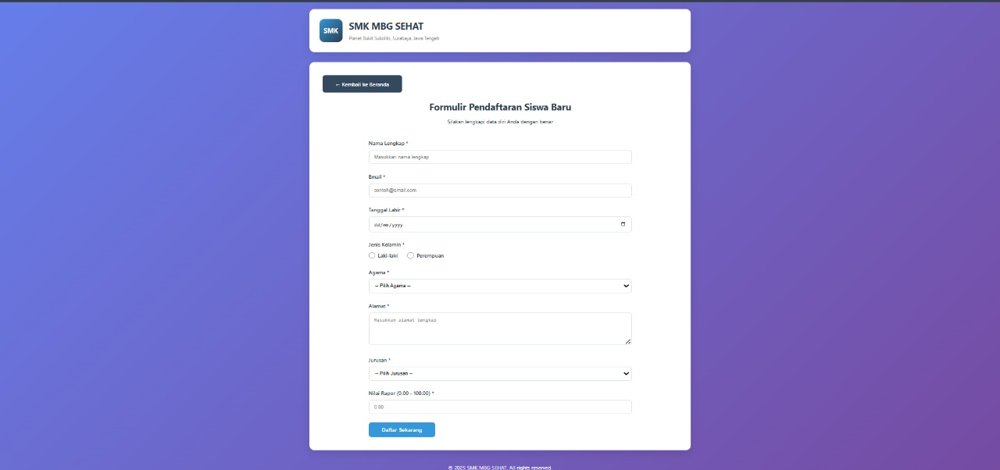
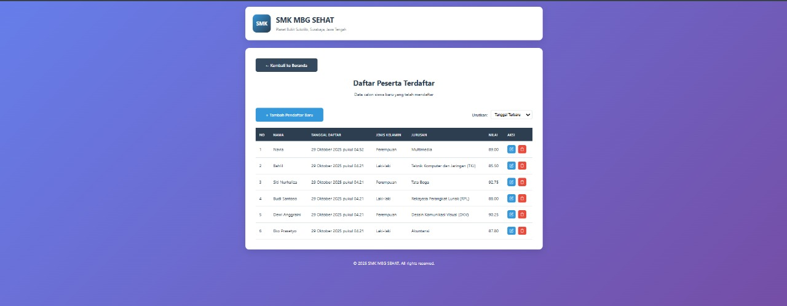
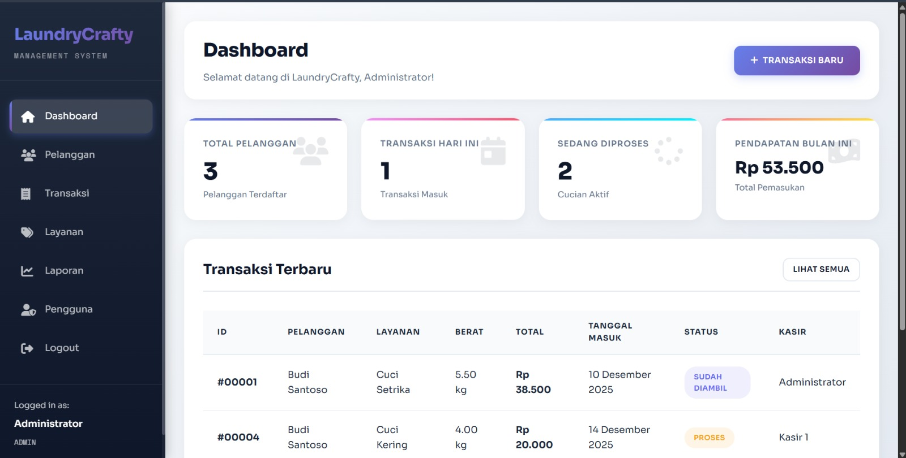
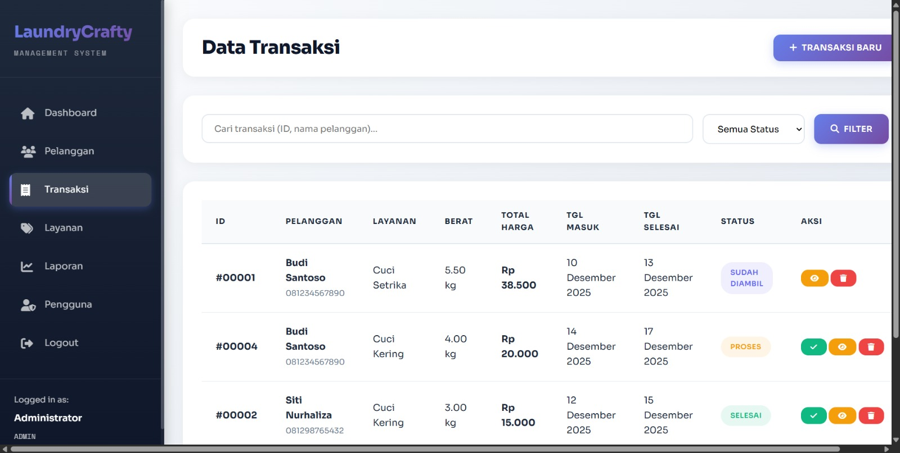
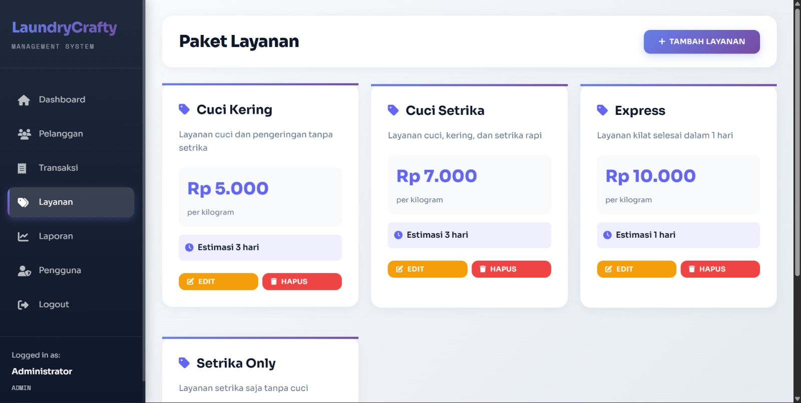
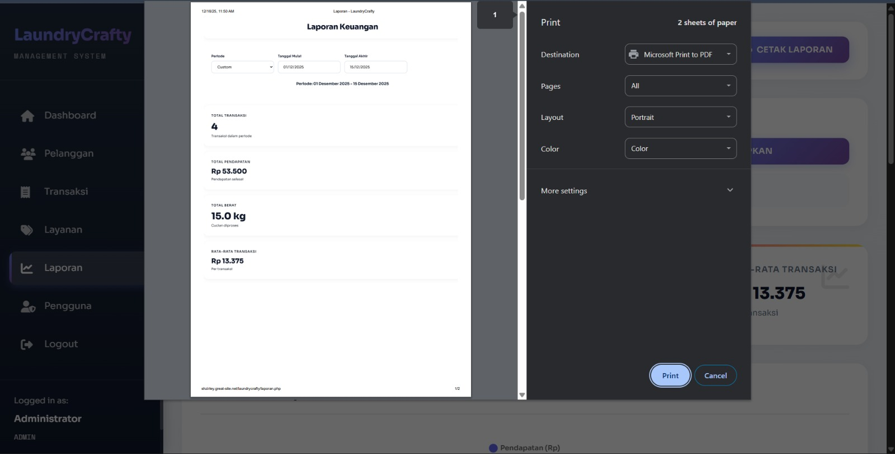
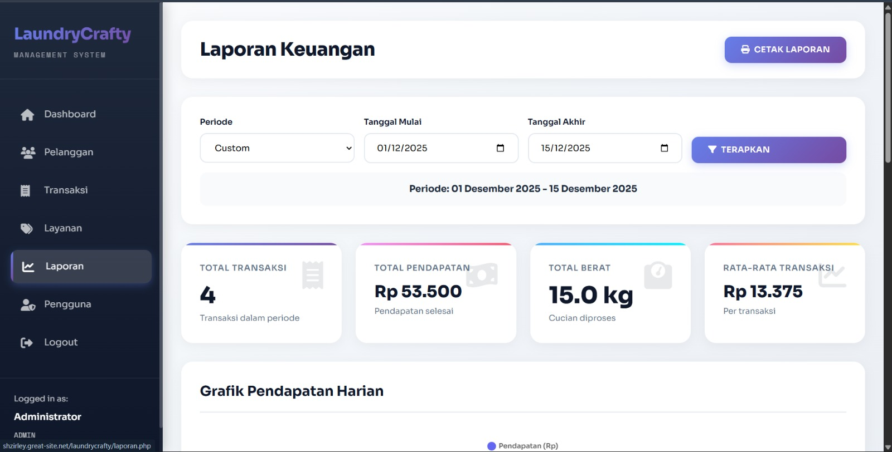
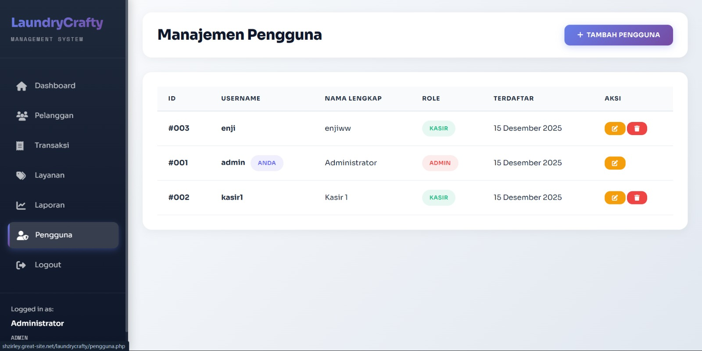
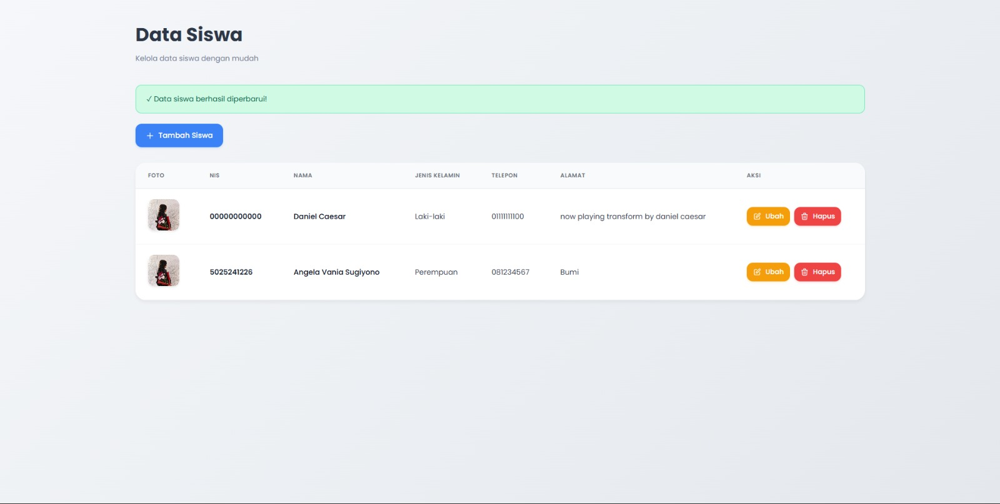

# Identitas
- **Nama**: Angela Vania Sugiyono
- **NRP**: 5025241226
- **Kelas**: PWEB A

---

# LAPORAN TUGAS PEMROGRAMAN WEBSITE PERTEMUAN 1

## Deskripsi Latihan
Pada pertemuan ke-1 ini, kami belajar typewriting untuk melatih kemampuan mengetik kami.
Untuk melihat hasil dapat dilihat di bawah berikut:

### Link Web
Untuk melihat hasil dapat dilihat berikut:
[https://shzirley.github.io/tugas-5-pweb-a/](https://shzirley.github.io/tugas-1-pweb-a/)

### Link Folder
Bisa dilihat pada [folder1](pertemuan1/)

---

# LAPORAN TUGAS PEMROGRAMAN WEBSITE PERTEMUAN 2

## Deskripsi Latihan

Website profil personal ini dibuat sebagai bentuk ke-10, yaitu Tugas Profil dengan Semua Elemen yang berisikan:
- Judul profil (heading)
- Paragraf deskripsi diri
- Foto profil (image)
- Daftar hobi (list)
- Tabel riwayat pendidikan
- Form kontak sederhana
- Link ke media sosial

---

## Fitur dan Komponen Website

### 1. Header dan Profil


Bagian header menampilkan:
- **Foto profil** dengan border radius 50% untuk membuat bentuk lingkaran
- **Nama lengkap** dengan typography yang menonjol
- **Subtitle** yang menjelaskan status sebagai mahasiswa Teknik Informatika ITS
- **Background gradient** berwarna biru gelap (#2c3e50) karena biru warna favorit saya hehe

**Implementasi Teknis:**
```css
.header {
    background: #2c3e50;
    color: white;
    padding: 30px;
    text-align: center;
}

.profile-img {
    width: 120px;
    height: 120px;
    border-radius: 50%;
    border: 3px solid white;
    object-fit: cover;
}
```

### 2. Deskripsi Diri
Berisi paragraf yang menjelaskan:
- Latar belakang akademik
- Passion terhadap teknologi dan penelitian
- Minat pada teknologi ramah lingkungan
- Visi untuk menciptakan dampak positif

### 3. Hobi dan Minat


**Implementasi Grid Layout:**
```css
.hobbies-list {
    list-style: none;
    display: grid;
    grid-template-columns: repeat(auto-fit, minmax(200px, 1fr));
    gap: 10px;
}

.hobbies-list li {
    background: #3498db;
    color: white;
    padding: 10px 15px;
    border-radius: 5px;
    text-align: center;
}
```

Fitur yang ditampilkan:
- **Penelitian Teknologi**
- **Teknologi Ramah Lingkungan** 
- **Pengembangan Aplikasi**
- **Menulis Esai Ilmiah**
- **Video Editing**
- **Sustainability Project**

### 4. Tabel Riwayat Pendidikan
Menampilkan informasi pendidikan dalam format tabel dengan:
- **Header berwarna gelap** (#2c3e50) dengan teks putih
- **Alternating row colors** untuk kemudahan membaca
- **Border styling** untuk pemisah yang jelas

**Implementasi Teknis:**
```css
.education-table {
    width: 100%;
    border-collapse: collapse;
    border: 1px solid #ddd;
}

.education-table th {
    background: #2c3e50;
    color: white;
}

.education-table tr:nth-child(even) {
    background: #f9f9f9;
}
```

### 5. Form Kontak


Form kontak interaktif ini dibuat untuk memudahkan pengunjung jika ingin menghubungi saya tanpa membuka banyak aplikasi secara manual. Fitur form kontak sebagai berikut:
- **Input fields** untuk Nama, Email, Subjek, dan Pesan
- **Styling konsisten** dengan border radius dan padding
- **Focus state** dengan perubahan warna border
- **JavaScript validation** dan feedback

**Implementasi Teknis:**
```css
.contact-form {
    background: #f9f9f9;
    padding: 20px;
    border-radius: 5px;
    border: 1px solid #ddd;
}

.form-group input:focus,
.form-group textarea:focus {
    outline: none;
    border-color: #3498db;
}
```

**JavaScript untuk Handling:**
```javascript
function handleSubmit(event) {
    event.preventDefault();
    alert('Terima kasih! Pesan Anda telah diterima.');
    event.target.reset();
}
```

### 6. Media Sosial


Links ke platform media sosial dengan:
- **Button styling** yang konsisten
- **Hover effects** untuk interaktivitas
- **Target blank** untuk link eksternal

**Implementasi Teknis:**
```css
.social-link {
    background: #3498db;
    color: white;
    text-decoration: none;
    padding: 10px 20px;
    border-radius: 5px;
    display: inline-block;
}

.social-link:hover {
    background: #2980b9;
    color: white;
}
```

---

## Aspek Teknis Website

### 1. Struktur HTML
- **Semantic HTML5** dengan penggunaan tag yang appropriate
- **Container-based layout** untuk kontrol yang lebih baik
- **Section-based organization** untuk kemudahan maintenance

### 2. CSS Styling
- **CSS Grid** untuk layout hobi yang responsive
- **Flexbox** untuk alignment media sosial
- **Box model** dengan box-sizing: border-box
- **Custom properties** untuk konsistensi warna
- **Media queries** untuk responsivitas

### 3. Responsive Design
```css
@media (max-width: 600px) {
    .hobbies-list {
        grid-template-columns: 1fr;
    }
    
    .social-links {
        flex-direction: column;
        align-items: center;
    }
}
```

### 4. Typography dan Visual Hierarchy
- **Font stack**: Arial, sans-serif untuk compatibility
- **Color scheme**: Biru (#3498db) dan abu-abu gelap (#2c3e50)
- **Consistent spacing** dengan padding dan margin yang teratur
- **Visual separation** menggunakan border dan background colors

### 5. Interaktivity
- **Form handling** dengan JavaScript
- **Hover states** pada buttons dan links
- **Focus states** pada form inputs
- **Smooth transitions** untuk better UX

### 6. Accessibility Features
- **Alt text** pada gambar
- **Proper labeling** pada form elements
- **Color contrast** yang memenuhi standar
- **Keyboard navigation** support

---

## Deployment
Website ini di-deploy menggunakan **GitHub Pages** dengan:
- Single HTML file untuk kemudahan deployment
- Inline CSS dan JavaScript untuk portability
- Optimized untuk loading speed
- Compatible dengan static hosting

---

## Kesimpulan
Tugas ini melatih mahasiswa untuk bisa kenal lebih dalam mengenai HTML dan CSS, yaitu layouting dengan berbagai teknik seperti CSS Grid untuk mengatur daftar hobi, Flexbox untuk alignment media sosial, responsive design dengan media queries, serta styling components seperti form, table, dan button. Melalui pembuatan website profil ini, mahasiswa dapat memahami konsep semantic HTML, CSS positioning, dan best practices dalam web development yang dapat diterapkan untuk proyek-proyek web development selanjutnya.

### Link Web
Untuk melihat hasil dapat dilihat berikut:
[!pertemuan2](https://shzirley.github.io/tugas-2-pweb-a/pertemuan2.html)

### Link Folder
Bisa dilihat pada [folder2](pertemuan2/)

---

# LAPORAN TUGAS PEMROGRAMAN WEBSITE PERTEMUAN 3

## Deskripsi Latihan
Pada pertemuan ke-3 kali ini, kami belajar pembuatan table, frame, dan juga form menggunakan HTML

Untuk melihat hasil dapat dilihat di bawah berikut:

### a. table


### b. frame


---
## Kesimpulan
Melalui latihan ini, mahasiswa dapat memahami dan mempraktikkan tiga hal penting dalam pemrograman web dasar, yaitu:

1. Layout halaman web → dengan memanfaatkan elemen HTML5 (header, nav, main, footer) serta CSS, mahasiswa belajar menyusun tampilan web agar rapi, terstruktur, dan enak dibaca.
2. Tabel data → penggunaan tabel (table, thead, tbody, tr, th, td) melatih mahasiswa menyajikan informasi dalam bentuk yang mudah dipahami, sekaligus melatih keterampilan styling tabel agar lebih menarik.
3. Formulir (Form) → pembuatan form dengan berbagai input (teks, email, select, password, tombol) melatih mahasiswa membuat antarmuka interaktif yang dapat digunakan untuk mengumpulkan data pengguna.

Dengan menggabungkan ketiga komponen tersebut, mahasiswa tidak hanya belajar menulis kode HTML, tetapi juga memahami konsep perancangan antarmuka web yang baik, yakni terstruktur, fungsional, dan user-friendly.

---

# LAPORAN TUGAS PEMROGRAMAN WEBSITE PERTEMUAN 4

## Deskripsi Latihan
Pada pertemuan ke-4 ini, kami belajar bagaimana cara memperindah web menggunakan css

Untuk melihat hasul dapat dilihat di bawah berikut:

### Dokumentasi page 1


### Dokumentasi page 2


### Link Web
Untuk melihat hasil dapat dilihat berikut:
https://shzirley.github.io/tugas-4-pweb-a/

### Link Folder
Bisa dilihat pada [folder4](pertemuan4/)

---

# LAPORAN TUGAS PEMROGRAMAN WEBSITE PERTEMUAN 5

## Deskripsi Latihan
Pada pertemuan ke-5 ini, kami belajar bagaimana perngimpelentasian JS pada form Mahasiswa dan Produk

Untuk melihat hasil dapat dilihat di bawah berikut:

### Dokumentasi page form produk


### Dokumentasi page form mahasiswa


### Link Web
Untuk melihat hasil dapat dilihat berikut:
https://shzirley.github.io/tugas-5-pweb-a/

### Link Folder
Bisa dilihat pada [folder5](pertemuan5/)

---

# LAPORAN TUGAS PEMROGRAMAN WEBSITE PERTEMUAN 6

## Deskripsi Latihan
Pada pertemuan ke-6 ini, kami belajar bagaimana pengimpelentasian bootstrap pada page login dan registrasi.

Untuk melihat hasil dapat dilihat di bawah berikut:

### Dokumentasi page form login


### Dokumentasi page form registrasi


### Link Web
Untuk melihat hasil dapat dilihat berikut:
https://shzirley.github.io/tugas-6-pweb-a/login.html

### Link Folder
Bisa dilihat pada [folder6](pertemuan6/)

--- 

# LAPORAN TUGAS PEMROGRAMAN WEBSITE PERTEMUAN 7

## Deskripsi Latihan

Pada pertemuan ke-7 ini, kami belajar bagaimana pengimplementasian **Asynchronous JavaScript and XML (AJAX)** dalam proses pengiriman *form* (*submit form*) **tanpa memuat ulang halaman** (*without refresh*). Implementasi ini memanfaatkan kombinasi **jQuery** di sisi klien (*client-side*) untuk berkomunikasi secara asinkron dengan skrip **PHP** di sisi server (*server-side*). Seluruh proyek ini kemudian di-*hosting* secara *online* agar dapat didemonstrasikan.

-----

## Analisis Kode dan Implementasi Fungsi Utama

Tugas ini berhasil diimplementasikan menggunakan tiga file utama yang saling berinteraksi: `index.html`, `style.css`, dan `process.php`.

### 1\. `index.html` (Antarmuka dan Mesin AJAX)

| Komponen | Fungsi Utama | Keterangan Implementasi |
| :--- | :--- | :--- |
| **HTML Form** | Menampilkan elemen input (`Name`, `Email`, `Message`) dan tombol *submit*. | Menggunakan `id="contactForm"` yang menjadi target JavaScript. Atribut `action` form dikosongkan karena pengiriman dikendalikan oleh AJAX. |
| **Validasi Klien (jQuery)** | Melakukan pemeriksaan awal pada input (kolom kosong, format email) sebelum data dikirim ke server. | Menggunakan fungsi `if(name === '') { ... }` dan `if(!email.match(emailPattern)) { ... }` untuk validasi instan. |
| **Mekanisme AJAX** | Mengirim data formulir ke server secara asinkron dan menangani respons. | Fungsi `e.preventDefault()` mencegah *refresh*. Objek `$.ajax()` mengirim data formulir (`$(this).serialize()`) ke **`process.php`** menggunakan metode **POST**. |
| **Status Umpan Balik** | Memberikan indikator kepada pengguna selama proses pengiriman. | Fungsi `beforeSend` menampilkan gambar *loader*. Fungsi `success` menerima respons dari PHP dan menampilkannya di `div class="message_box"`. |

### 2\. `process.php` (Logika Server)

| Baris Kode | Fungsi Utama | Keterangan Implementasi |
| :--- | :--- | :--- |
| <code>if ($_SERVER["REQUEST_METHOD"] == "POST")</code> | **Pemeriksaan Metode** | Memastikan skrip hanya memproses permintaan yang datang dari metode HTTP POST (sesuai dengan permintaan AJAX). |
| <code>trim($_POST['name'])</code> | **Pengambilan dan Sanitasi Data** | Mengambil data yang dikirim oleh formulir AJAX dan membersihkan spasi putih di awal/akhir input. |
| <code>if ($name == '' &#124;&#124; ...)</code> | **Validasi Server** | Melakukan pemeriksaan wajib terhadap data untuk mencegah data kosong masuk ke pemrosesan lebih lanjut. |
| <code>filter_var($email, FILTER_VALIDATE_EMAIL)</code> | **Validasi Format Email** | Menggunakan fungsi bawaan PHP yang kuat untuk memverifikasi keabsahan format alamat email. |
| <code>echo "&lt;span style='color:green;'&gt;...&lt;/span&gt;";</code> | **Pencetakan Respons** | Mencetak string HTML (pesan sukses atau error) yang akan menjadi balasan (<code>data</code>) yang diterima dan ditampilkan oleh JavaScript. |

### 3\. `style.css` (Gaya Tampilan)

File ini berisi *style sheet* yang mengatur desain agar *form* terlihat modern dan responsif, termasuk penataan posisi form di tengah layar dan pemberian gaya visual pada pesan status (`.success` dan `.error`).

-----

## Dokumentasi dan Hasil Demo Online
Seluruh file telah diunggah dan di-*hosting* secara *online* menggunakan platform **GreatSite**, memungkinkan demonstrasi fungsionalitas AJAX secara *live*.

### Dokumentasi Tampilan Form


### Link Web Demo
Untuk melihat hasil implementasi secara langsung:
[https://shzirley.great-site.net/pertemuan7/](https://shzirley.great-site.net/pertemuan7/)

### Link Folder
Bisa dilihat pada [folder7](pertemuan7/)

-----

## Kesimpulan

Latihan ini berhasil mengimplementasikan AJAX untuk *form submission*, memberikan **pengalaman pengguna (UX) yang ditingkatkan**.

1.  **Pengalaman Non-Blocking:** Dengan AJAX, pengguna tidak perlu menunggu halaman dimuat ulang. Data formulir dikirim di latar belakang, memberikan umpan balik yang cepat dan efisien.
2.  **Efisiensi Sumber Daya:** Hanya data yang relevan yang dipertukarkan antara klien dan server, bukan seluruh halaman HTML.
3.  **Keamanan Berlapis:** Validasi dilakukan baik di sisi klien (untuk kecepatan) maupun di sisi server (`process.php`) sebagai langkah keamanan penting untuk memastikan data yang diproses selalu valid.

---

# LAPORAN TUGAS PEMROGRAMAN WEBSITE PERTEMUAN 9

### Link Web Demo
Untuk melihat hasil implementasi secara langsung:
[https://shzirley.great-site.net/tugas9pweb/](https://shzirley.great-site.net/tugas9pweb/)

### Dokumentasi



### Link Folder
Bisa dilihat pada [folder9](pertemuan9/)

# LAPORAN TUGAS PEMROGRAMAN WEBSITE PERTEMUAN 10

# PUSPA: Platform E-Commerce Kustomisasi Buket Bunga & Florist Supply
**Area Operasional:** Surabaya

## 1. Deskripsi Umum
**Puspa** adalah aplikasi web berbasis e-commerce yang dirancang untuk merevolusi pengalaman membeli bunga dengan konsep **"Hybrid Florist"**. Platform ini memberikan fleksibilitas penuh kepada pengguna melalui tiga model pembelian utama:

* **Ready-to-Go:** Membeli buket yang sudah dirangkai indah.
* **Custom Builder:** Meracik desain buket sendiri dari nol.
* **DIY Experience:** Membeli bahan baku mentah untuk dirangkai sendiri di rumah.

Berfokus pada area Surabaya, Puspa mengintegrasikan fitur kustomisasi produk mendalam dengan sistem logistik otomatis (penjadwalan jemput & kalkulasi ongkir berbasis jarak).

---

## 2. Fitur Utama & Logika Bisnis

### A. Katalog Produk (Product & Supply)
Sistem mengelompokkan inventaris menjadi 3 kategori utama:

1.  **Fresh Flowers**
    * Penjualan bunga satuan/per tangkai (untuk mode kustomisasi).
    * Bunga paketan (untuk produk buket jadi).
2.  **Florist Tools**
    * Peralatan pendukung untuk pelanggan *DIY* (Gunting bunga, floral tape, busa/oasis, pita, dll).
3.  **Add-ons & Gifts**
    * Barang pelengkap non-bunga (Boneka wisuda, coklat, keychain, perhiasan).

### B. Smart Wrapper System (Logika Pembungkus)
Sistem menggunakan algoritma otomatis untuk penentuan harga kertas pembungkus (*wrapper*).

**Tier Wrapper:**
* **Basic:** Rp 8.000
* **Premium:** Rp 11.000

> **Aturan Promo (Logic Rule):**
> * **Jika total belanja kategori Bunga $\ge$ Rp 50.000:** Opsi *Basic Wrapper* menjadi **GRATIS**.
> * **Jika total belanja kategori Bunga < Rp 50.000:** *Basic Wrapper* dikenakan harga normal (Rp 8.000).
> * **Premium Wrapper:** Selalu harga penuh (Rp 11.000) tanpa diskon, berapapun total belanja.

### C. Custom Bouquet Builder & Services
**Builder Mode:**
User memilih item secara berurutan: `Pilih Bunga` $\rightarrow$ `Pilih Filler (Daun)` $\rightarrow$ `Pilih Wrapper`. Harga diperbarui secara *real-time*.

**Service Options:**
* **Assembly Service (Jasa Rangkai):** User membayar biaya jasa tambahan. Produk dikirim dalam bentuk buket jadi. Termasuk fitur input pesan untuk kartu ucapan.
* **DIY Mode:** Tidak ada biaya jasa. Semua item dikirim dalam bentuk lepasan (*loose flowers*) agar user dapat merangkai sendiri.

### D. Manajemen Logistik (Scope: Surabaya)
**1. Self-Pickup (Ambil di Toko)**
* **Biaya:** Gratis.
* **Syarat:** User wajib memilih slot waktu (*Date & Time*) saat *checkout* untuk pengambilan.

**2. Delivery (Kurir Instan)**
* **Pricing:** Berbasis jarak (*Distance-based pricing*).
* **Metode:** Integrasi Maps/Koordinat untuk menghitung jarak dari toko ke lokasi user.
* **Rumus:**
    $$Biaya = Jarak (km) \times Tarif per km$$

---

## 3. Alur Pengguna (User Flow) Singkat

1.  **Homepage:** User memilih mode belanja (*Beli Buket Jadi* / *Custom Sendiri* / *Beli Alat*).
2.  **Selection:** User memilih item (Contoh: 5 Mawar, 1 Coklat, 1 Gunting).
3.  **System Check:** Sistem memvalidasi logika promo wrapper (Apakah total bunga mencapai Rp 50.000?).
4.  **Checkout:**
    * Isi kartu ucapan (jika memilih jasa rangkai).
    * Pilih metode pengiriman (*Delivery* atau *Pickup*).
        * *Jika Delivery:* Set lokasi pin point.
        * *Jika Pickup:* Pilih slot waktu ambil.
5.  **Pembayaran:**
    * Total = Harga Produk + Jasa Rangkai (Opsional) + Ongkir (Jika delivery).

---

# LAPORAN TUGAS PEMROGRAMAN WEBSITE PERTEMUAN 11

## Deskripsi Proyek
Pada pertemuan ke-11 ini, kami membuat sistem manajemen laundry berbasis web bernama **LaundryCrafty** menggunakan PHP dan MySQL. Sistem ini memiliki fitur lengkap untuk mengelola pelanggan, transaksi, layanan, laporan keuangan, dan manajemen pengguna dengan interface yang modern dan responsif.

### Fitur Utama:
- Dashboard dengan statistik real-time
- Manajemen Pelanggan (CRUD)
- Manajemen Transaksi dengan kalkulasi otomatis
- Paket Layanan Laundry
- Laporan Keuangan dengan grafik Chart.js
- Manajemen Pengguna (Admin & Kasir)
- Role-based Access Control
- Security dengan password hashing (bcrypt)

Untuk melihat hasil dapat dilihat di bawah berikut:

---

## Dokumentasi

### 1. Dashboard

*Dashboard menampilkan statistik total pelanggan, transaksi hari ini, cucian diproses, dan pendapatan bulan ini*

### 2. Data Pelanggan

*Halaman manajemen pelanggan dengan fitur tambah, edit, hapus, dan pencarian*

### 3. Data Transaksi

*Halaman transaksi dengan kalkulasi otomatis, filter status, dan update status cucian*

### 4. Paket Layanan

*Tampilan paket layanan laundry dengan harga per kilogram dan durasi pengerjaan*

### 5. Laporan Keuangan

*Halaman laporan dengan filter periode dan statistik keuangan*


*Grafik pendapatan harian dan pendapatan per layanan dengan persentase*

### 6. Manajemen Pengguna

*Halaman manajemen pengguna untuk admin mengelola akun kasir*

---

## Teknologi yang Digunakan
- **Front-End**: HTML5, CSS3, JavaScript, Chart.js, Font Awesome
- **Back-End**: PHP 8.x
- **Database**: MySQL
- **Server**: Apache (XAMPP untuk lokal, InfinityFree untuk hosting)
- **Typography**: Google Fonts (Sora & Space Mono)

---

## Kredensial Login
- **Admin**: 
  - Username: `admin`
  - Password: `password`
- **Kasir**: 
  - Username: `kasir1`
  - Password: `password`

---

## Link Web
Untuk melihat hasil dapat dilihat berikut:
**http://shzirley.great-site.net/laundrycrafty/login.php**

---

## Link Folder
Bisa dilihat pada [pertemuan11](pertemuan11/)

---

# LAPORAN TUGAS PEMROGRAMAN WEBSITE PERTEMUAN 12

## Deskripsi Proyek
Pada pertemuan ke-12 ini, kami membuat sistem manajemen data siswa berbasis web menggunakan PHP dan MySQL. Sistem ini memiliki fitur lengkap CRUD (Create, Read, Update, Delete) untuk mengelola data siswa dengan interface yang modern, minimalist, dan user-friendly.

### Fitur Utama:
- Manajemen Data Siswa (CRUD)
- Upload & Manage Foto Siswa
- Validasi NIS Unik
- Interface Modern & Minimalist
- Responsive Design
- Notifikasi Success/Error
- Auto-generate Avatar jika tidak ada foto
- Anti-cache untuk update foto
- Smooth Animations

Untuk melihat hasil dapat dilihat di bawah berikut:

---

## Dokumentasi

### 1. Dashboard - Halaman Utama

*Halaman utama menampilkan tabel data siswa dengan foto, NIS, nama, jenis kelamin, telepon, alamat, dan tombol aksi (Ubah & Hapus)*

### 2. Form Ubah Data Siswa

*Form untuk mengedit data siswa dengan preview foto saat ini dan opsi untuk mengganti foto*

---

## Struktur Database

### Tabel: `siswa`
| Field | Type | Keterangan |
|-------|------|------------|
| id | INT(11) | Primary Key, Auto Increment |
| nis | VARCHAR(20) | Nomor Induk Siswa (Unique) |
| nama | VARCHAR(100) | Nama Lengkap Siswa |
| jenis_kelamin | ENUM('Laki-laki', 'Perempuan') | Jenis Kelamin |
| telepon | VARCHAR(15) | Nomor Telepon |
| alamat | TEXT | Alamat Lengkap |
| foto | VARCHAR(255) | Nama File Foto (Nullable) |
| created_at | TIMESTAMP | Waktu Pembuatan Data |
| updated_at | TIMESTAMP | Waktu Update Data |

---

## Struktur File

```
tugas12/
├── images/                     # Folder untuk foto siswa
├── index.php                   # Halaman utama (Read)
├── koneksi.php                 # Konfigurasi database
├── form_simpan.php             # Form tambah siswa (Create)
├── form_ubah.php               # Form edit siswa (Update)
├── proses_simpan.php           # Proses tambah data
├── proses_ubah.php             # Proses update data
├── proses_hapus.php            # Proses hapus data (Delete)
├── setup.php                   # Setup database otomatis
├── check_upload.php            # Debug tool upload
├── mydatascole.sql             # File database SQL
└── README.md                   # Dokumentasi
```

---

## Fitur Teknis

### 1. CRUD Operations
- **Create**: Form tambah siswa dengan validasi dan upload foto
- **Read**: Tabel data siswa dengan foto, sorting, dan empty state
- **Update**: Form edit dengan preview foto lama dan opsi ganti foto
- **Delete**: Hapus data dengan konfirmasi dan auto-delete foto

### 2. Upload & Foto Management
- Support format: JPG, PNG, GIF
- Max size: 5MB
- Auto-generate nama file unik
- Auto-delete foto lama saat update/delete
- Anti-cache dengan timestamp
- Fallback avatar otomatis (initial nama)

### 3. Validasi
- NIS harus unik (tidak boleh duplikat)
- Semua field required kecuali foto
- Validasi tipe dan ukuran file
- Server-side & client-side validation

### 4. User Experience
- Alert notifikasi success/error
- Smooth animations & transitions
- Loading states
- Responsive design (mobile-friendly)
- Clean & minimalist interface
- Hover effects & micro-interactions

### 5. Security
- Prepared statements (mysqli_real_escape_string)
- File upload validation
- SQL injection prevention
- XSS prevention (htmlspecialchars)
- Secure file naming

---

## Teknologi yang Digunakan

- **Front-End**: 
  - HTML5
  - CSS3 (Custom Styling)
  - JavaScript (Vanilla JS)
  - Google Fonts (Poppins)
  - SVG Icons

- **Back-End**: 
  - PHP 7.4+
  - MySQL/MariaDB

- **Server**: 
  - Apache (XAMPP untuk lokal)
  - InfinityFree untuk hosting

- **Tools**:
  - phpMyAdmin untuk database management
  - VSCode untuk development

---

## Konfigurasi Database

```php
define('DB_HOST', 'localhost');
define('DB_USER', 'root');
define('DB_PASS', '');
define('DB_NAME', 'dc_siswa');
define('DB_PORT', 3307);
```

---

## Cara Instalasi

### 1. Setup Lokal (XAMPP)
```bash
# Copy project ke htdocs
D:\xampp\htdocs\tugas12\

# Start Apache & MySQL di XAMPP Control Panel

# Buka browser
http://localhost/tugas12/setup.php

# Klik "Mulai Setup Database"

# Setelah selesai, buka aplikasi
http://localhost/tugas12/
```

### 2. Import Database Manual
```sql
-- Via phpMyAdmin atau MySQL CLI
CREATE DATABASE dc_siswa;
USE dc_siswa;

-- Import file mydatascole.sql
```

### 3. Setup Folder Images
```bash
# Buat folder images dengan permission write
mkdir images
chmod 777 images
```

---

## Fitur Khusus

### 1. Auto Database Setup
File `setup.php` akan otomatis:
- Membuat database jika belum ada
- Membuat tabel siswa
- Insert data contoh
- Membuat folder images/
- Menampilkan progress setup

### 2. Debug Upload Tool
File `check_upload.php` untuk troubleshooting:
- Cek PHP upload configuration
- Cek status folder images/
- List semua foto yang sudah diupload
- Rekomendasi fix masalah

### 3. Anti-Cache Foto
Sistem menambahkan timestamp di URL foto untuk mencegah browser cache foto lama saat update.

### 4. Avatar Default
Jika siswa tidak memiliki foto, sistem otomatis generate avatar SVG dengan initial nama (2 huruf pertama).


---

## Link Demo
Untuk melihat hasil dapat dilihat berikut:
**https://shzirley.great-site.net/tugas12/**

---

## Link Folder
Bisa dilihat pada [pertemuan12](pertemuan12/)

---

## Kesimpulan

Sistem CRUD Data Siswa ini berhasil diimplementasikan dengan fitur lengkap dan interface yang modern. Aplikasi ini dapat digunakan untuk mengelola data siswa di sekolah dengan mudah dan efisien. Dengan desain yang minimalist dan responsive, aplikasi ini dapat diakses dari berbagai perangkat.

---

# Laporan Final Project: Implementasi Teknis Sistem Florist

**Sistem Informasi Florist "Puspa"** dikembangkan menggunakan pendekatan *Native PHP Hybrid*, di mana logika antarmuka (*Frontend*) dan logika server (*Backend*) terintegrasi dalam satu arsitektur aplikasi (*Monolithic*). Berikut adalah rincian teknis implementasinya.

## 1\. Frontend & Backend Development

Pengembangan sistem dibagi menjadi dua sisi utama: sisi klien (*client-side*) yang berfokus pada estetika dan responsivitas, serta sisi server (*server-side*) yang menangani logika bisnis.

### A. Frontend Development (Antarmuka Pengguna)

Fokus utama adalah memastikan website dapat diakses dengan baik melalui perangkat desktop maupun seluler.

#### 1\. Teknologi & Komponen yang Digunakan

Berdasarkan struktur file proyek, teknologi utama meliputi:

  * **HTML5 (Hypertext Markup Language)**
      * **Fungsi:** Membangun kerangka dasar semantik halaman web.
      * **Implementasi:** Digunakan di semua file `.php` (seperti `index.php`, `dashboard.php`) untuk menyusun struktur DOM (*Document Object Model*).
  * **CSS3 & Bootstrap 5.3.0**
      * **Fungsi:** Menangani tata letak (*layout*) responsif dan *styling* visual secara cepat.
      * **File Pendukung:** `style.css` (kustomisasi landing page) dan `dashboard.css` (layout spesifik halaman admin).
      * **Komponen Bootstrap:** Menggunakan *Grid System* (untuk menyusun katalog produk), *Navbar* (navigasi responsif), *Card* (kontainer produk), dan *Modal* (notifikasi/popup).
  * **Bootstrap Icons**
      * **Fungsi:** Menyediakan elemen visual vektor yang ringan tanpa membebani *load time*.
      * **Implementasi:** Digunakan pada ikon keranjang (`bi-cart`), profil user (`bi-person`), dan rating bintang (`bi-star-fill`).

#### 2\. Implementasi Halaman Utama

Halaman antarmuka dibagi menjadi dua konteks utama berdasarkan status login pengguna:

  * **Public Landing Page (`index.php`)**
      * Merupakan halaman statis yang berfungsi sebagai etalase toko bagi pengunjung umum.
      * **Fitur:** Menampilkan *Hero Section* dengan latar gambar menarik, kategori produk, dan testimoni pelanggan.
      * **Logika Tampilan:** Navbar menggunakan logika kondisional PHP. Jika user belum login, tombol "Login with Google" ditampilkan. Jika sudah login, sistem menampilkan nama user dan foto profil.
  * **User Dashboard (`dashboard.php`)**
      * Halaman dinamis yang hanya dapat diakses setelah otentikasi berhasil.
      * **Fitur Utama:**
          * **Sidebar Tetap:** Navigasi vertikal untuk akses cepat ke Profil, Riwayat Pesanan, dan Review.
          * **Katalog Dinamis:** Menampilkan produk yang diambil secara *real-time* dari database.
          * **Pencarian:** Bilah pencarian di bagian atas untuk memfilter produk.

### B. Backend Development (Logika Server)

Sisi backend bertanggung jawab penuh atas pemrosesan data, manajemen sesi (*session*), keamanan, dan komunikasi dengan pihak ketiga (Google API).

#### 1\. File & Logika Backend

Arsitektur backend dibangun secara modular untuk memudahkan pemeliharaan kode:

  * **`config.php`:** Berfungsi sebagai pusat konfigurasi sistem. File ini menginisialisasi koneksi ke database MySQL menggunakan `mysqli` (dengan konfigurasi Host: `127.0.0.1`, Port: `3307` untuk stabilitas koneksi XAMPP) dan mengatur kredensial *Google Client API*.
  * **Dependency Management (`composer.json` & `vendor/`):** Menggunakan **Composer** untuk mengelola library eksternal. Library utama yang diinstal adalah `google/apiclient` yang digunakan untuk menangani protokol otentikasi OAuth 2.0 yang kompleks.

#### 2\. Implementasi Autentikasi (Google OAuth 2.0)

Sistem menggunakan fitur "Login with Google" untuk mempermudah akses pengguna tanpa perlu proses registrasi manual yang panjang.

  * **Alur Teknis:**
    1.  User mengklik link login yang digenerate secara dinamis oleh fungsi `$client->createAuthUrl()`.
    2.  Google mengarahkan user kembali ke file **`google_callback.php`** dengan membawa parameter `code`.
    3.  Backend menukar `code` tersebut dengan *Access Token* yang valid.
    4.  Data profil (Email, Nama, Foto) diambil dari layanan Google.
    5.  **Logika Database:** Backend mengecek tabel `users`.
          * Jika email belum ada → Lakukan `INSERT` (User Baru).
          * Jika email sudah ada → Lakukan `UPDATE` (Sinkronisasi data terbaru).
    6.  Status login disimpan dalam variabel global `$_SESSION['user_login']`.

#### 3\. Implementasi Katalog Produk (Server-Side Rendering)

Fitur ini menggunakan konsep *Server-Side Rendering* (SSR) di mana data diproses di server sebelum halaman dikirim ke browser.

  * **Data Fetching:** Pada file `dashboard.php`, script mengeksekusi query SQL `SELECT * FROM products` untuk mengambil seluruh data.
  * **Dynamic Rendering:** Hasil query diulang menggunakan struktur kontrol `while`. Setiap baris data database (Nama, Harga, Stok) dirender menjadi kartu HTML.
  * **Handling Gambar:** Backend memanggil URL gambar eksternal (Unsplash) yang disimpan dalam kolom `image` (tipe data `TEXT`) di database. Metode ini memastikan gambar tampil berkualitas tinggi tanpa membebani penyimpanan server lokal.

#### 4\. Manajemen Keranjang & Transaksi

Logika bisnis untuk transaksi ditangani oleh file-file pendukung:

  * **`keranjang.php`:** Bertugas mengelola penambahan item ke dalam *Session Array* (`$_SESSION['cart']`). Penggunaan session memungkinkan keranjang belanja bertahan selama browser aktif tanpa perlu menulis data ke database secara terus-menerus (mengurangi beban server).
  * **`checkout.php`:** Menangani kalkulasi akhir. Script ini merekapitulasi item yang ada di session keranjang, menghitung subtotal, menambahkan biaya layanan, dan memproses data final sebelum disimpan ke tabel riwayat pesanan.

#### 5\. Keamanan & Proteksi Akses

Backend menerapkan lapisan keamanan standar untuk melindungi data dan mencegah akses ilegal:

  * **Session Hijacking Prevention:** Setiap halaman privat (`dashboard.php`, `checkout.php`) diawali dengan pengecekan sesi yang ketat:
    ```php
    if (!isset($_SESSION['user_login'])) {
        header("Location: index.php"); // Tendang ke halaman depan
        exit();
    }
    ```
    Script ini menolak akses langsung (*Direct URL Access*) oleh pengguna yang tidak dikenal.
  * **SQL Injection Protection:** Input dari pengguna (seperti kata kunci pada fitur pencarian) disanitasi menggunakan fungsi `real_escape_string` sebelum dimasukkan ke dalam query database.
  * **Environment Isolation:** Penggunaan port database spesifik (3307) dan IP `127.0.0.1` meminimalkan risiko konflik port dan akses jaringan yang tidak diinginkan pada lingkungan lokal.

-----

## 2\. Database Implementation

Implementasi basis data pada sistem **Puspa Florist** dirancang menggunakan **MySQL (MariaDB)**. Desain database menerapkan prinsip **Relational Database Management System (RDBMS)** yang ketat untuk memastikan integritas data, efisiensi penyimpanan, dan skalabilitas fitur e-commerce.

### A. Desain Skema Database (Schema Design)

Database proyek ini diberi nama **`puspa`**. Berdasarkan skema final, sistem terdiri dari **7 entitas tabel** yang saling berelasi, dibagi menjadi dua kategori:

#### 1\. Master Data (Data Utama)

Tabel-tabel ini menyimpan informasi inti yang jarang berubah namun sering diakses (*read-heavy*).

  * **Tabel `users` (Manajemen Pengguna)**
      * **`id` (PK):** *Auto Increment Integer*.
      * **`google_id`:** *Varchar(255)*. Menyimpan ID unik dari API Google sebagai validasi login utama.
      * **`picture`:** *Varchar(255) / TEXT*. Digunakan untuk menyimpan URL foto profil.
      * **Analisis Teknis:** Struktur ini didesain *password-less*, artinya tidak ada kolom password karena otentikasi ditangani sepenuhnya oleh pihak ketiga (Google).
  * **Tabel `products` (Inventaris Produk)**
      * **`price`:** *DECIMAL(10, 0)*. Penggunaan tipe data `DECIMAL` sangat krusial untuk aplikasi toko guna menghindari kesalahan pembulatan (*floating point error*) yang sering terjadi pada tipe `FLOAT`.
      * **`description`:** *TEXT*. Kolom ini menampung deskripsi naratif panjang mengenai filosofi bunga.
      * **`main_image`:** *Varchar*. Menyimpan nama file gambar utama (*thumbnail*) untuk tampilan kartu di dashboard.
      * **`stock` & `sold`:** *Integer*. Digunakan untuk manajemen stok dan pelacakan popularitas produk (*best seller*).

#### 2\. Transactional & Feature Data (Data Fitur)

Tabel-tabel ini menangani interaksi pengguna dengan produk. Keunggulan skema ini adalah penggunaan **Foreign Key** dengan kendala **`ON DELETE CASCADE`**.

  * **Tabel `carts` (Keranjang Belanja)**
      * **Fungsi:** Menyimpan status belanjaan pengguna sebelum proses *checkout*.
      * **Relasi:** *Many-to-Many* (User ↔ Product).
      * **Logika Bisnis:** Setiap baris merepresentasikan satu jenis item dalam keranjang user. Jika User atau Produk dihapus oleh admin, data keranjang terkait akan otomatis hilang (*Cascade*), mencegah error transaksi pada barang yang sudah tidak ada.
  * **Tabel `favorites` (Wishlist)**
      * **Fungsi:** Fitur personalisasi "Simpan untuk nanti".
      * **Relasi:** Menghubungkan `user_id` dan `product_id`.
      * **Analisis:** Memungkinkan analisis preferensi pengguna tanpa harus melihat riwayat transaksi.
  * **Tabel `reviews` (Ulasan & Rating)**
      * **Fungsi:** *Social Proof* untuk meningkatkan kepercayaan pembeli.
      * **Struktur Unik:** Tabel ini menyimpan `user_name` dan `user_avatar` secara manual (*snapshot*), bukan hanya `user_id`.
      * **Relasi:** Terikat pada `products`. Jika produk dihapus, semua ulasannya ikut terhapus.
  * **Tabel `product_images` (Galeri Multi-Gambar)**
      * **Fungsi:** Mendukung fitur galeri (*Carousel*), di mana satu jenis bunga bisa memiliki banyak sudut foto.
      * **Relasi:** *One-to-Many* (Satu Produk punya Banyak Gambar).
      * **Implementasi:** Memisahkan gambar tambahan dari tabel utama `products` adalah praktik *Normalisasi Database* untuk menjaga tabel utama tetap ramping dan cepat diakses.
  * **Tabel `notifications` (Sistem Notifikasi)**
      * **Fungsi:** Memberikan umpan balik asinkron kepada user.
      * **Kolom Kunci:** `is_read` bertipe **`TINYINT(1)`** (sebagai Boolean 0/1) untuk membedakan notifikasi baru dan lama.

### B. Analisis Relasi & Integritas Data (ERD)

Kekuatan utama database **Puspa Florist** terletak pada **Referential Integrity**. Berikut adalah peta relasi teknisnya:

1.  **User ➡️ Carts (1:N):** Satu user bisa memiliki banyak baris di keranjang (banyak jenis bunga).
2.  **Product ➡️ Carts (1:N):** Satu jenis bunga bisa ada di keranjang banyak user berbeda.
3.  **User ➡️ Favorites (1:N):** User bisa menyukai banyak bunga.
4.  **Product ➡️ Reviews (1:N):** Satu bunga memiliki sekumpulan ulasan.
5.  **Product ➡️ Product\_Images (1:N):** Satu bunga memiliki galeri foto detail.

#### Implementasi `ON DELETE CASCADE`

Dalam file SQL, semua *Foreign Key* menggunakan aturan `ON DELETE CASCADE`.

```sql
FOREIGN KEY (product_id) REFERENCES products(id) ON DELETE CASCADE
```

**Dampak Teknis:** Ini adalah fitur *"Self-Cleaning"*. Admin tidak perlu menghapus data secara manual satu per satu. Jika admin menghapus produk "Mawar Merah", maka secara otomatis semua data terkait (foto galeri, ulasan, item di keranjang user) akan ikut terhapus. Hal ini menjaga database tetap bersih dari sampah data (*Orphan Records*).

-----

## 3\. Integrasi Application Programming Interface (API)

Dalam pengembangan sistem informasi **Puspa Florist**, integrasi API (*Application Programming Interface*) diterapkan untuk menangani dua fungsi krusial: autentikasi pengguna dan pemrosesan pembayaran. Sistem ini bertindak sebagai *client* yang mengonsumsi layanan dari penyedia pihak ketiga, yaitu Google dan Midtrans, guna meningkatkan efisiensi pengembangan dan keamanan data.

### A. Google OAuth 2.0 untuk Autentikasi

Sistem menggunakan layanan **Google Identity Services** dengan protokol OAuth 2.0 untuk fitur login. Implementasi ini memanfaatkan pustaka `google/apiclient` yang dikonfigurasi pada file `config.php` menggunakan *Client ID* dan *Client Secret* yang terdaftar di Google Cloud Console.

**Mekanisme Alur (*Authorization Code Flow*):**

1.  **Request:** Saat pengguna memilih masuk dengan Google, sistem mengarahkan pengguna ke halaman persetujuan Google.
2.  **Callback:** Setelah disetujui, Google mengembalikan *authorization code* ke endpoint **`google_callback.php`**.
3.  **Token Exchange:** Sistem kemudian menukarkan kode tersebut dengan *Access Token* untuk mendapatkan informasi profil pengguna (email, nama, dan foto).
4.  **Session:** Data profil disimpan ke dalam basis data lokal (`users`) sebagai sesi login aktif.

### B. Midtrans Snap untuk Gerbang Pembayaran

Untuk memfasilitasi transaksi non-tunai, sistem terintegrasi dengan **Midtrans Payment Gateway** menggunakan tipe integrasi *Snap*. Integrasi ini memungkinkan jendela pembayaran muncul secara *pop-up* (overlay) di halaman checkout tanpa mengalihkan pengguna keluar dari website.

**Alur Teknis:**

1.  **Backend (`checkout.php`):** Sistem mengalkulasi total belanja dan biaya tambahan, lalu mengirimkan data tersebut dalam bentuk *payload JSON* ke server Midtrans.
2.  **Frontend:** Respon dari API Midtrans berupa **Snap Token** kemudian digunakan oleh fungsi JavaScript `window.snap.pay()` di sisi frontend untuk memunculkan antarmuka pembayaran yang aman dan mendukung berbagai metode pembayaran (GoPay, Virtual Account, Kartu Kredit).

-----

# 4\. Dokumentasi Sistem & Manajemen Proyek

Bagian ini memuat dokumentasi visual alur kerja sistem, panduan penggunaan aplikasi bagi pengguna akhir (*end-user*), serta pembagian tanggung jawab tim pengembang.

## A. Diagram Alur Sistem (Flowchart)

Untuk memperjelas logika bisnis dan navigasi pengguna, berikut adalah visualisasi alur sistem pada website **Puspa Florist**:

### 1\. Alur Login & Akses Web

Diagram ini menggambarkan mekanisme autentikasi pengguna menggunakan integrasi *Google OAuth 2.0*. Pengguna tidak perlu melakukan registrasi manual; sistem akan otomatis memvalidasi email dan membuat sesi aktif.


### 2\. Alur Belanja & Transaksi

Diagram ini menjelaskan perjalanan pengguna (*User Journey*) mulai dari memilih produk di katalog, memasukkan ke keranjang, hingga penyelesaian pembayaran menggunakan *Midtrans Payment Gateway*.


-----

## B. User Guide (Panduan Pengguna)

Panduan ini menjelaskan tata cara penggunaan sistem **Puspa Florist**, mencakup proses autentikasi, eksplorasi katalog, hingga penyelesaian transaksi.

### 1\. Akses & Autentikasi Akun

Sistem menerapkan kebijakan *login-first* demi keamanan transaksi dan personalisasi pengalaman pengguna.

1.  **Mengakses Halaman Utama:** Buka alamat website Puspa Florist. Pengguna akan disambut oleh *Landing Page* yang menampilkan spanduk promosi dan etalase kategori.
2.  **Login dengan Google:** Klik tombol **"Login with Google"**. Jendela *pop-up* Google akan muncul. Pilih akun Google (Gmail) yang aktif. Sistem akan memverifikasi kredensial dan mengarahkan pengguna ke **Dashboard** secara otomatis.

### 2\. Eksplorasi Katalog Produk

Setelah login, pengguna diarahkan ke *User Dashboard*.

1.  **Melihat Daftar Produk:** Produk ditampilkan dalam format kartu (*grid view*) yang memuat foto, nama bunga, harga, dan stok.
2.  **Pencarian:** Gunakan bilah pencarian (*Search Bar*) di bagian atas untuk menyaring produk berdasarkan nama bunga.
3.  **Detail Produk:** Klik pada kartu produk untuk melihat deskripsi filosofis, galeri foto, dan ulasan pembeli.

### 3\. Transaksi Pembelian

1.  **Menambah ke Keranjang:** Klik tombol keranjang pada produk yang diinginkan.
2.  **Mengelola Keranjang:** Klik ikon **Keranjang** (`bi-cart`) di menu atas. Pengguna dapat mengubah jumlah item atau menghapus produk yang tidak jadi dibeli.
3.  **Checkout:** Klik tombol **"Checkout"**. Sistem akan menampilkan ringkasan alamat pengiriman dan total biaya (termasuk biaya layanan).
4.  **Pembayaran:** Klik **"Bayar Sekarang"**. Jendela *pop-up* **Midtrans** akan muncul. Pilih metode pembayaran (GoPay/VA/QRIS) dan selesaikan transaksi.

### 4\. Manajemen Fitur Pengguna

  * **Riwayat Pesanan:** Memantau status transaksi yang pernah dilakukan.
  * **Review Saya:** Memberikan rating bintang dan ulasan pada produk yang telah dibeli.
  * **Produk Favorit:** Mengakses daftar produk yang disimpan dalam *Wishlist*.
  * **Logout:** Mengakhiri sesi pengguna dengan aman.

-----

## C. Pembagian Jobdesk (Tim Pengembang)

Untuk memastikan kelancaran integrasi sistem antara antarmuka dan logika server, tim pengembang membagi tanggung jawab berdasarkan peran utama (*Role*) sebagai berikut:

| Nama Anggota & NRP | Role Utama | Rincian Tanggung Jawab (Jobdesk) |
| :--- | :--- | :--- |
| **Maleka Ghaniya**<br>(5025241189) | Frontend Designer & UI/UX | • Pengembangan *Landing Page* (`index.php`)<br>• *Styling* Global (`style.css`) & *Branding* (Logo/Aset Visual)<br>• Penyusunan Laporan Proyek & Dokumentasi Awal |
| **Angela Vania S.**<br>(5025241226) | Frontend Developer | • Pengembangan *Dashboard User* (`dashboard.php`)<br>• Implementasi UI Flow Transaksi (Keranjang, Checkout, Detail Produk)<br>• Pengembangan Halaman Fitur User (Review, Favorit, History) |
| **Jorell Ramos S.**<br>(5025241202) | Fullstack Engineer | • **Backend:** Desain Database, Konfigurasi Server (`config.php`), & Integrasi API (*Google/Midtrans*)<br>• **Frontend Support:** Membantu integrasi logika PHP ke dalam tampilan *Landing Page* (Maleka) & *Dashboard* (Angela)<br>• **System Integration:** *Debugging* isu tampilan (*responsive layout*) dan konektivitas data antar halaman |

-----

## Link Demo:
[Klik Disini untuk demo website](https://fp-pweb-puspa.great-site.net/)
